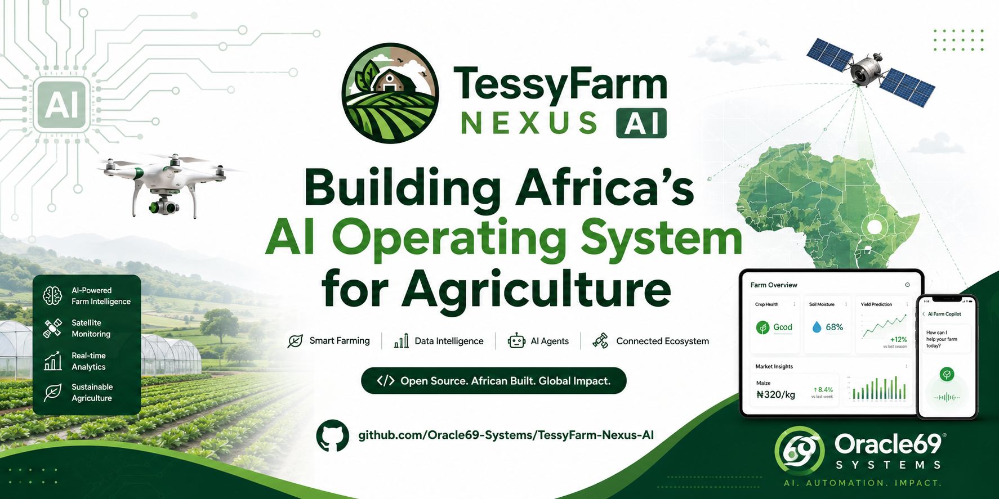
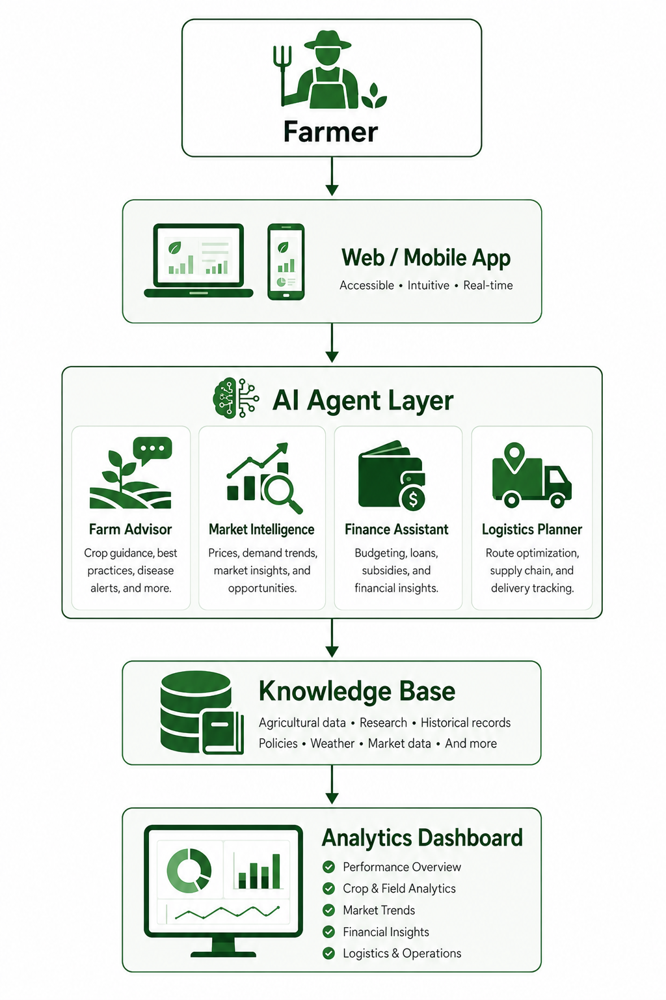
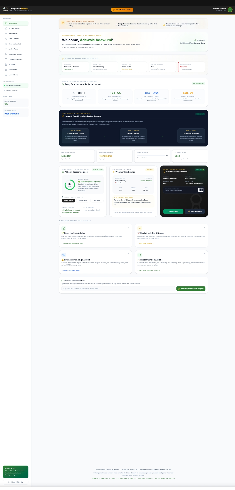
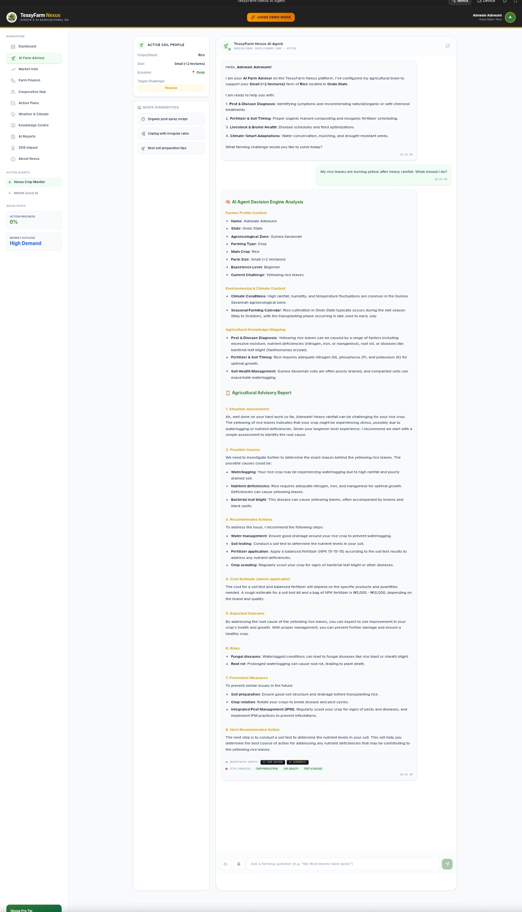
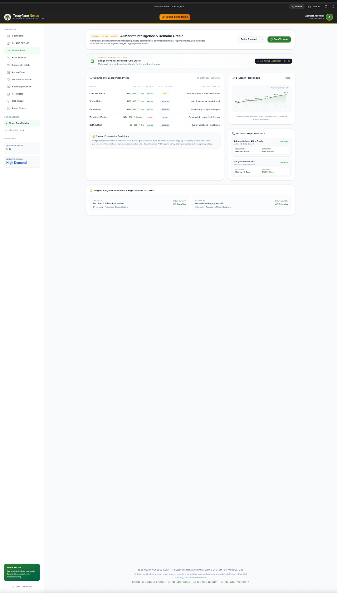
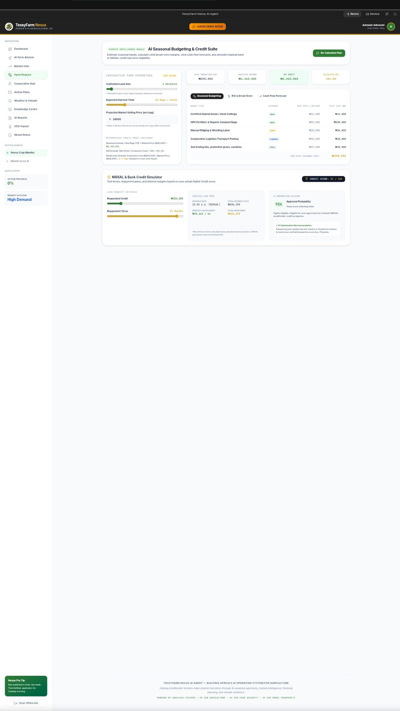

# 🌾 TessyFarm Nexus AI

> Building Africa's AI Operating System for Agriculture.
---

<p align="center">
  
</p>


> Building Africa's AI Operating System for Agriculture.


An AI-powered platform that helps farmers, cooperatives, agribusinesses, processors, financial institutions, and governments make smarter decisions through intelligent automation, market intelligence, predictive analytics, and AI agents.

Developed by Oracle69 Systems.


---

## 🌍 Vision

Africa's agricultural sector loses billions annually due to fragmented information, poor market coordination, inefficient logistics, and limited access to real-time decision support.

TessyFarm Nexus AI is designed to become the operating system that connects farmers, buyers, logistics providers, financial institutions, extension officers, and policymakers through one intelligent platform.

Our mission is simple:

> Transform African agriculture into an AI-powered, data-driven ecosystem that increases productivity, profitability, and resilience.


---

## 🚜 Problems We Solve

- Poor market access
- Post-harvest losses
- Inefficient logistics
- Low farmer productivity
- Limited access to agricultural knowledge
- Poor price transparency
- Weak supply chain coordination
- Lack of AI-powered decision support

---

## 🧩 Core Modules

AI Farm Advisor

Provides crop recommendations, disease diagnosis, fertilizer guidance, and farming best practices using conversational AI.


---

Market Intelligence

Tracks commodity prices, demand forecasts, buyer opportunities, and regional market trends.


---

Logistics Intelligence

Coordinates transportation, aggregation centers, warehouses, and delivery routes.


---

Financial Intelligence

Supports budgeting, farm profitability analysis, credit readiness, and investment planning.


---

Knowledge Engine

Maintains an institutional knowledge base for farmers, cooperatives, and agricultural organizations.


---

### AI Agent Platform

Specialized AI agents collaborate to automate agricultural operations and decision-making.

**AI Agents include:**

- 🌱 Agronomist Agent
- 📈 Market Intelligence Agent
- 🚚 Logistics Agent
- 💰 Finance Agent
- 📋 Compliance Agent
- 🌦️ Weather Intelligence Agent


---

### ✨ Key Features

- 🌾 AI-powered crop advisory
- 📈 Market forecasting and price intelligence
- 🚚 Smart logistics planning
- 👨‍🌾 Farmer profiling and digital identity
- 📚 Digital extension services
- 🤝 Cooperative management
- 🛒 Commodity marketplace
- 📊 Real-time analytics dashboard
- 🤖 AI chat assistant
- 📱 Offline-first architecture
- 📲 Mobile-first experience
- 🌍 Multi-language support


---

### 💻 Technology Stack

| Layer | Technologies |
|--------|--------------|
| **Frontend** | React, TypeScript, Tailwind CSS, Vite |
| **Backend** | Node.js, Express.js |
| **Database** | PostgreSQL, Firebase |
| **Artificial Intelligence** | Gemini, Groq, OpenAI-compatible LLMs |
| **Infrastructure & DevOps** | Docker, GitHub Actions, Vercel, Render |


---

## 🏗️ Architecture



### System Flow

```text
...

```text
Farmer
   │
   ▼
Web / Mobile App
   │
   ▼
AI Agent Layer
 ├── Farm Advisor
 ├── Market Intelligence
 ├── Finance Assistant
 └── Logistics Planner
   │
   ▼
Knowledge Base
   │
   ▼
Analytics Dashboard
```

---

## 📸 Screenshots

| Dashboard | AI Assistant |
|-----------|--------------|
|  |  |

| Market Intelligence | Farm Analytics |
|----------------------|----------------|
|  |  |

## 📂 Repository Structure

```text
src/
components/
pages/
hooks/
services/
api/
database/
public/
docs/
assets/
```


---

## 🚀 Roadmap

### Phase 1
- [x] Core platform
- [x] Farmer onboarding
- [x] Dashboard
- [x] AI Chat Assistant

### Phase 2
- [ ] Market Intelligence
- [ ] Logistics Engine
- [ ] Cooperative Portal
- [ ] Buyer Portal

### Phase 3
- [ ] Satellite imagery
- [ ] IoT sensor integration
- [ ] Drone support
- [ ] Offline synchronization

### Phase 4
- [ ] Multi-country deployment
- [ ] Carbon credit tracking
- [ ] Export marketplace
- [ ] Agricultural finance ecosystem


---

## 🤝 Contributing

We welcome developers, researchers, agronomists, designers, and ecosystem partners interested in advancing AI for agriculture.

1. Fork the repository.


2. Create a feature branch.


3. Commit your changes.


4. Open a Pull Request.


---

## 📄 License

This project is released under the MIT License.


---

```markdown
## About Oracle69 Systems

Oracle69 Systems designs AI-powered operational systems that automate work, improve decision-making, and deliver measurable outcomes across agriculture, healthcare, education, enterprise, and the public sector.

🌐 **Website:** https://www.oracle69.com

💼 **LinkedIn:** https://www.linkedin.com/in/oracle69digitalmarketing

📧 **Email:** adewaleadewumi78@gmail.com


**Let's build the future of agriculture with AI.**

